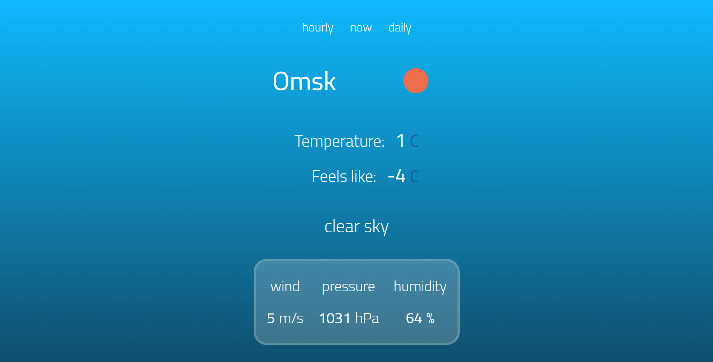

# Simple Weather App

## Contents

-   [Overview](#overview)
    -   [Description](#description)
    -   [Screenshots](#screenshots)
    -   [Links](#links)
-   [My process](#my-process)
    -   [Built with](#built-with)
    -   [What I learned](#what-i-learned)

## Overview

### Description

Simple weather app with HTML, CSS, JavaScript and Weather API

### Screenshots

### Links

-   Repo URL: [https://github.com/andy-devs/weather-app](https://github.com/andy-devs/weather-app)
-   Live Site URL: [https://andy-devs.github.io/weather-app/](https://andy-devs.github.io/weather-app/)

## My process

### Built with

-   HTML
-   CSS
-   JavaScript
-   [WeatherAPI](https://openweathermap.org/api)

### What I learned

I tried to work with public API for the first time. It was hard but very interesting. Now I have better understanding of promises and fetch.

